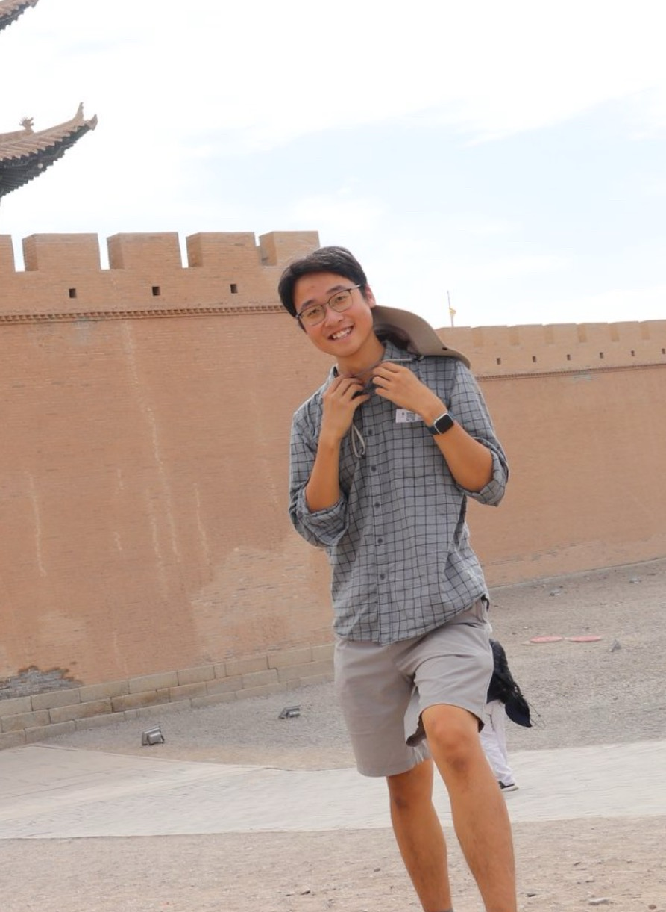

# 个人主页

| 文件 | 说明 |
|---|---|
| `index.html` | English（默认首页） |
| `zh.html` | 中文 |
| `style.css` | 两版共用 |
| `cv-en.pdf` / `cv.pdf` | 英文简历 / 中文简历（已去掉手机号） |
| `library.html` | Zotero 论文库只读索引（支持搜索、主题筛选与批注量筛选） |
| `blog.html` | 中文研究博客索引 |
| `imagine-interpret-act-talk.html` | “Imagine, Interpret, Act” 中文博客与论文解读页 |
| `vla-next-step.html` | VLA 研究方向中文博客笔记与组会讲解页 |
| `blog.css` | 博客索引页样式 |
| `library-overrides.css` | 论文库页面与主页统一的版式样式 |
| `paper-talk.css` | 论文讲解页样式（含投屏、移动端、暗色与打印适配） |
| `research-note.css` | VLA 研究笔记页样式（含移动端、暗色与打印适配） |
| `app/library-data.ts` | 论文库数据快照（由 Zotero 导出） |
| `robo-1..3.jpg` | RoboNeo 现场作业照片 |
| `harnessvla.mp4` | HarnessVLA 闭环标注演示视频 |
| `imagine-interpret-act.png` | “Imagine, Interpret, Act” 论文结果图 |
| `wechat.png` | 微信二维码 |

右上角有 English | 中文 切换。

## 上线前只差一样

**头像。** 存成 `photo.jpg` 放本目录，然后把两个 html 里的

```html
<div class="photo">photo.jpg</div>
```

换成

```html

```

不放头像也能上线，只是那一格会显示占位文字，看起来没完工。

## 部署

仓库名必须**正好**是 `yqzhou886.github.io`：

```bash
cd homepage
git init && git add . && git commit -m "personal homepage"
git branch -M main
git remote add origin git@github.com-roswellii:yqzhou886/yqzhou886.github.io.git
git push -u origin main
```

然后 Settings → Pages → Source 选 `Deploy from a branch` → `main` / `root`，
等 1–2 分钟访问 https://yqzhou886.github.io

## 更新

改完直接 `git push`，GitHub Pages 自动重新发布。
简历改了要重新执行：

```bash
cd .. && xelatex cv-zh.tex && xelatex cv-zh.tex && pdflatex cv-en.tex && pdflatex cv-en.tex \
  && cp cv-zh.tex cv-web.tex && sed -i '' '/180-7292-6017/d' cv-web.tex \
  && xelatex cv-web.tex && xelatex cv-web.tex \
  && cp cv-web.pdf homepage/cv.pdf && cp cv-en.pdf homepage/cv-en.pdf
```
