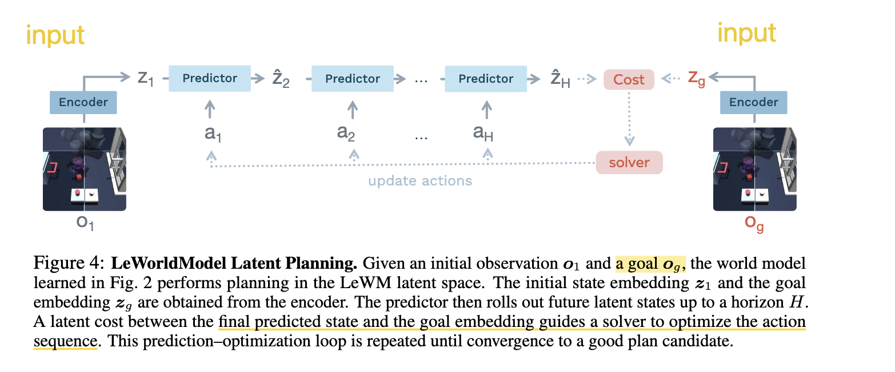
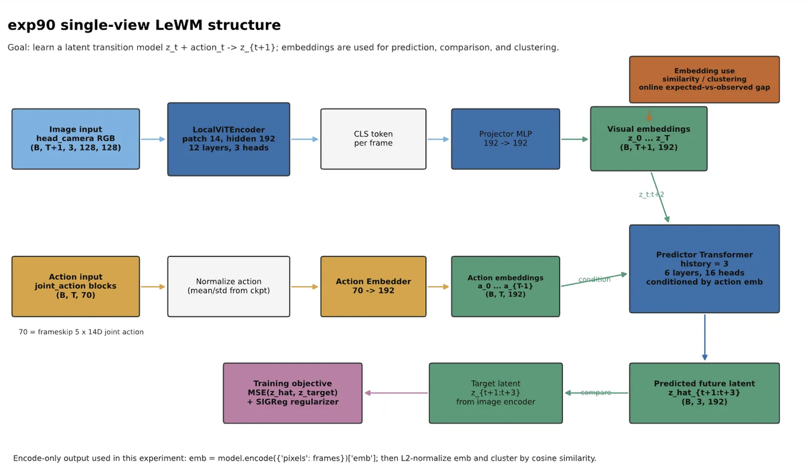
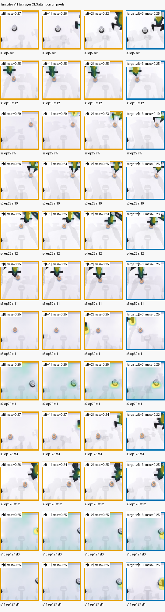
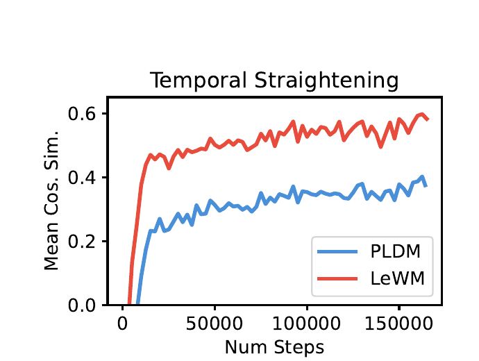
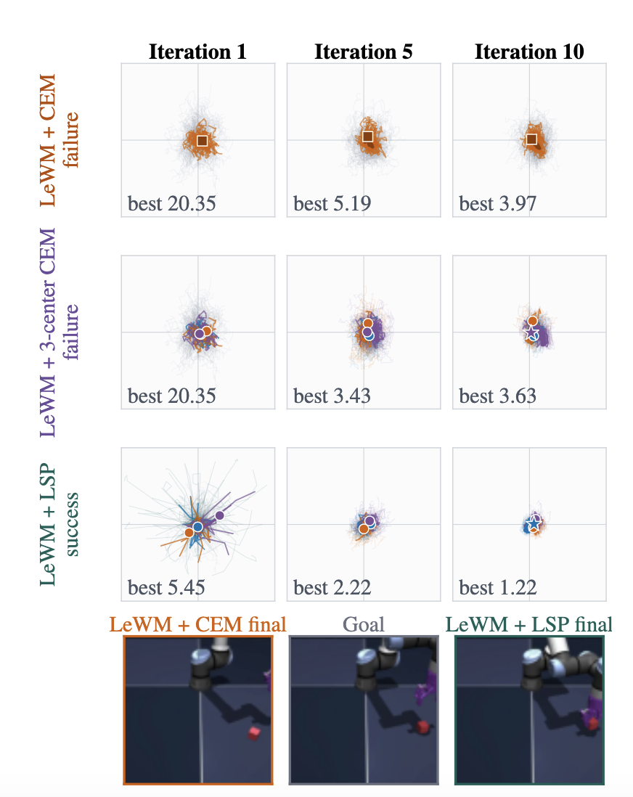
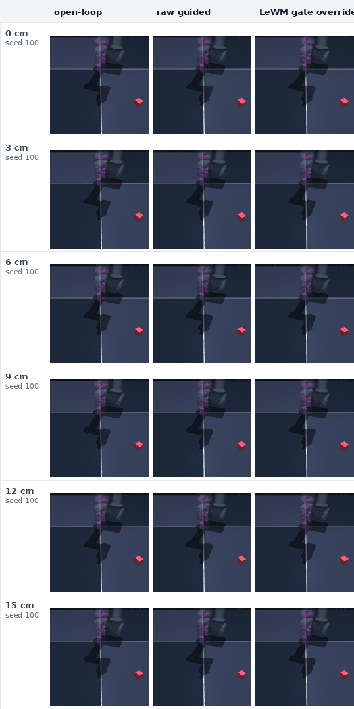
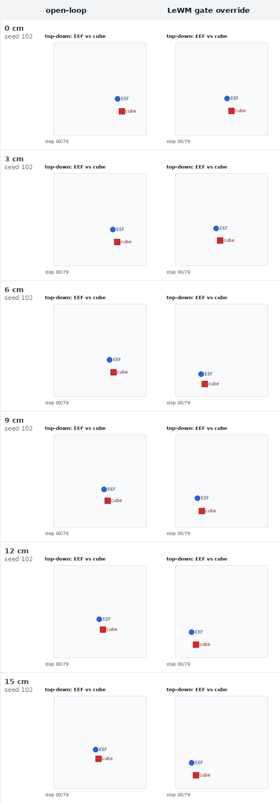
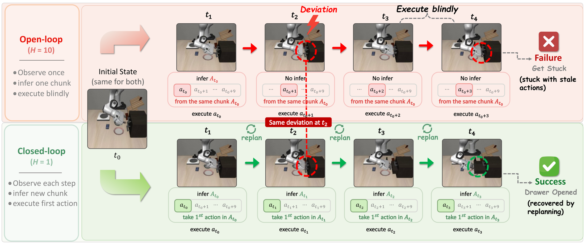
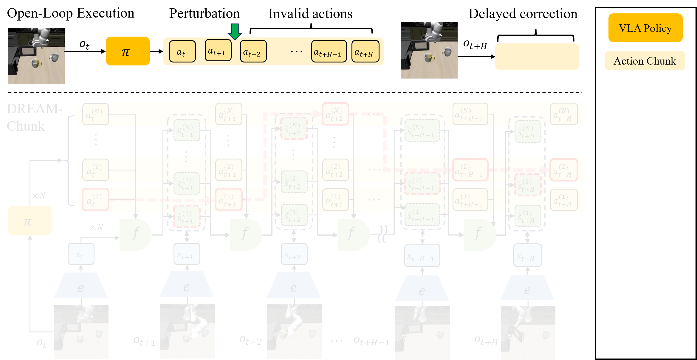

# Imagine, Interpret, Act

## Giving Temporal Latents a Sense of Progress

论文讲解

**Yiqun Zhou**, Jiaxiang Zhou, Yizheng Huang, Xiao Liu, Yuechen Wu, Feixiang Jing

[论文 PDF](imagine-interpret-act.pdf)

## 一句话概括

世界模型能够预测“动作之后会发生什么”，但未必理解这个变化是否让任务更接近目标。本文提出 Latent Sense of Progress（LSP）：先把预测 latent 组织成一个面向当前目标的进度坐标，再用这个进度改善动作搜索的初始候选。


**最重要的设计边界：**进度只负责告诉规划器“从哪里开始搜”，最终候选仍由原世界模型的 terminal cost 评分。


---

## 一、基线：LeWM 如何用 CEM 规划



*LeWM latent planning：当前观测与目标观测分别经过 encoder 得到 $z_1$ 和 $z_g$；predictor 根据候选动作序列 rollout 至 $\hat z_H$；终端 latent cost 再指导 solver 更新动作，循环寻找更好的计划。*

**LeWM 是什么？** LeWM 是一个从图像学习的 latent world model。它先用同一个 encoder 把当前画面和目标画面压缩成 latent 表示，再根据一串候选动作，在 latent 空间里预测这些动作执行后会到达什么状态。预测终点越接近目标 latent，说明这串动作看起来越有希望。整个过程不需要先生成未来图像，只需在更紧凑的 latent 空间中预测和比较。

### LeWM 的结构



*图像经过 ViT encoder 和 projector 得到 visual embeddings；动作经过 action embedder 得到 action embeddings；predictor transformer 以两者为条件预测未来 latent，再与目标 latent 比较并计算训练损失。*

#### Encoder 注意力可视化



*每一行是一段 Cube 轨迹，前三列分别为 $z[t]$、$z[t+1]$ 和 $z[t+2]$ 的输入帧，最后一列是目标帧 $z[t+3]$。热力图显示 ViT encoder 最后一层 CLS token 对图像 patch 的注意力，主要用于检查 encoder 在连续状态中关注了哪些像素区域；它不是动作价值或任务进度的可视化。*

LeWM 的核心训练目标只有两项：

$$
\mathcal{L}_{\mathrm{LeWM}}
\triangleq
\mathcal{L}_{\mathrm{pred}}
+ \lambda\,\mathrm{SIGReg}(\mathbf{Z}).
$$

其中，$\mathcal{L}_{\mathrm{pred}}$ 让 predictor 学会预测后续 latent，$\mathrm{SIGReg}(\mathbf{Z})$ 约束 latent 的整体分布、避免表示坍塌，使 encoder 和 predictor 能够从图像端到端稳定训练。

**CEM 规划是什么？** CEM 是一种通过反复采样来寻找动作的优化方法。它先从一个动作分布中随机生成许多候选动作序列，让 LeWM 分别预测其结果并计算终点 cost；随后保留 cost 最低的一小批候选，用它们更新动作分布，再进行下一轮采样。经过多轮迭代，候选动作会逐渐集中到更好的区域。不过，如果第一轮没有采到有用动作，CEM 很难找到正确方向；如果同时存在多种可行方案，单个分布也可能把它们平均掉。

---

## 二、问题：预测变化不等于理解进展

预测性世界模型的 latent 可以保留位置、接触和动作动力学等物理信息。规划时，模型 rollout 一组候选动作，再比较终点 latent 与目标 latent 的距离。

但同一个物理变化面对不同目标会有不同意义。机械臂把方块向右推：目标在右边时是前进，目标在左边时是倒退，目标只关心高度时则可能无关。单纯预测出“方块向右移动”并不能回答这三个判断。

### 什么是 latent straightness？

一段连续的视觉轨迹经过 encoder 后，会变成 latent 空间中的一串点：

$$
z_0 \rightarrow z_1 \rightarrow z_2 \rightarrow z_3 \rightarrow \cdots
$$

$$
\Delta z_t=z_{t+1}-z_t
$$

其中，$\Delta z_t$ 是相邻时刻的 latent displacement，表示这一步动作在模型内部造成的状态变化。LeWM 报告了一个自然出现的现象：随着预测训练进行，相邻 displacement 会越来越同向。也就是说，latent 轨迹原本可能不断弯折，训练后则更接近沿一个稳定方向演化。

经过 encoder 后，每个画面分别对应 $z_0$、$z_1$、$z_2$、$z_3$。如果 latent 的时间结构还比较混乱，相邻状态可能在空间中不断改变方向：

```text
训练早期：z₀ → z₁ ↗ z₂ ↓ z₃
```

虽然现实里方块始终向右移动，但 latent 中的轨迹比较弯折。随着 LeWM 的预测训练进行，相邻 displacement 逐渐对齐：

```text
训练后期：z₀ → z₁ → z₂ → z₃
```



*LeWM 原文 Figure 17。在 Push-T 训练过程中，纵轴是连续 latent velocity vectors 的平均余弦相似度，越高表示轨迹越直。LeWM 没有使用时间正则项，但仍形成了比 PLDM 更直的 latent 轨迹。[来源：LeWorldModel](https://arxiv.org/abs/2603.19312)*

---

## 三、LSP：从进度表示到进度引导搜索

LSP 的总逻辑是先让 latent “能够表达进度”，再让规划器“利用进度找到更好的搜索起点”：

LSP Shaping 利用轨迹的时间顺序构造距离目标，通过 direct、Bellman 和 imagined–observed consistency 损失调整共享 encoder 与 predictor，使当前 latent 到目标 latent 的余弦距离能够表示 goal-relative progress，而不需要奖励、阶段标签或独立的 progress head；

随后 LSP Search 用离线数据学习进度与动作序列之间的条件分布 $q(A\mid p)$，规划时只查询一次当前进度，用它生成一部分更符合当前任务阶段的初始候选，再通过均衡多中心 CEM 保留和优化不同动作模式。Progress 只决定“从哪里开始搜”，候选动作最终仍由 LeWM 原有的 terminal latent cost 评分和选择。

### 3.1 LSP Shaping：给共享 latent 加上进度语义

对状态 latent $z$ 和目标 latent $g$，作者直接用余弦距离定义目标相关的进度：

$$
d(z,g)=\frac{1}{2}\left(1-\cos(z,g)\right)
$$

$$
p(z,g)=1-d(z,g)
$$

$p$ 高表示当前状态接近这个视觉目标。它不是与任务无关的“绝对完成百分比”，也不是单独训练出来的 progress head，而是直接从共享 predictive latent 中读取。

#### 监督从哪里来？

训练数据只需要有时间顺序的轨迹。对每段序列，选择未来第 $h$ 个 macro step 的观测作为目标，并按照剩余步数构造距离目标 $y_r=1-\gamma^r$。越接近序列终点，目标距离应越小、进度应越大。

进度损失包含三部分：

1. **Direct matching：**让观测轨迹和想象轨迹的目标距离匹配按时间构造的目标。
2. **Bellman consistency：**约束相邻时刻的距离满足逐步递推关系，使局部变化获得方向。
3. **Imagined–observed consistency：**让同一时刻的 imagined latent 与 observed latent 具有一致的目标距离。

$$
L_{\mathrm{prog}}=L_{\mathrm{direct}}+L_B+0.25L_{\mathrm{cons}}
$$

$$
L=L_{\mathrm{pred}}+0.09L_{\mathrm{SIGReg}}+\alpha_eL_{\mathrm{prog}},
\qquad \alpha_e\leq0.002
$$

进度项的权重很小。这样做的目的只是组织 latent，而不是让一个一维顺序覆盖姿态、接触等对预测仍然重要的信息。

#### 这一部分应强调的三个点

- 不需要 reward、success 或 phase label。
- 目标和 horizon 用来构造训练损失，但不是 predictor 的输入 token。
- 没有单独的进度网络，梯度直接塑造共享 encoder 和 predictor。

---

### 3.2 LSP Search：进度只查询一次

世界模型微调结束后被冻结。作者把离线 action window 与对应的进度 $p(E(o),E(o_g))$ 配对，拟合一个 8 分量全协方差 GMM，得到条件动作分布 $q(A\mid p)$。

每次重规划的过程如下：

1. 根据当前状态和目标计算一次进度 $p(z_t,z_g)$。
2. 第一批 300 个候选中，一半来自原始零中心高斯，一半来自进度条件分布。
3. 仍用原始 terminal cost 选出 30 个全局 elites。
4. 把 elites 均衡拆成 3 个中心，每个中心独立运行局部 CEM。
5. 选择局部 elite 平均 cost 最低的中心，返回该中心的 elite mean。

“均衡”很重要：每个中心获得相同数量的 elite，避免最密集的一簇占满所有位置。这样可以在固定候选数下保留多个动作模式。

#### 进度与 cost 的职责没有混在一起

进度只影响第一批 proposal。它不参与 rollout 级重排，不作为在线 reward，也不替换世界模型的 evaluator。候选动作和最终中心始终由原来的 terminal latent cost 选择。

#### 额外开支

LSP Search 与普通 CEM 使用相同的候选数量、迭代次数和 world-model rollout 预算。额外计算主要来自一次 progress 查询、条件 GMM 采样、elite 均衡划分以及 3 个局部 CEM 中心的参数更新；8 分量 GMM 的拟合是一次性的离线开支。

| 任务 | CEM | LSP Search | 额外开支 |
|---|---:|---:|---:|
| Two-Room | 333.72 ms | 344.93 ms | 3.4% |
| Reacher | 334.97 ms | 343.18 ms | 2.5% |
| Push-T | 1002.23 ms | 1019.37 ms | 1.7% |
| Cube | 339.31 ms | 355.59 ms | 4.8% |

在保持相同 world-model evaluation 数量的情况下，LSP Search 的每次重规划时间仅增加 1.7%–4.8%。

---

## 四、实验结果

实验沿着“表示 → 初始 proposal → 闭环控制”的顺序验证，而不是只报告最终成功率。

### 闭环成功率是否提高？

| 任务 | LeWM + CEM | LeWM + LSP | 提升 |
|---|---:|---:|---:|
| Two-Room | 80.7% | **94.0%** | +13.3 pp |
| Reacher | 81.3% | **93.3%** | +12.0 pp |
| Push-T | 82.0% | **86.7%** | +4.7 pp |
| Cube | 70.0% | **84.7%** | +14.7 pp |


### 改善是否来自正确的进度条件？

在尚未解决的 Cube pairs 上，第一次 CEM 更新前的 success coverage 为：

- 正确进度：**74.7%**
- 只使用动作的 mixture：60.9%
- 打乱进度：54.0%
- 零中心高斯：40.2%

这说明正确进度在优化开始前就把更多有用动作放进了第一批候选，是目前最有力的机制证据。



*同一条 Cube replay。LSP 从更低 cost 的动作模式开始，并在后续多中心优化中保留该模式；两个对照最终失败。图中 cost 越低越好。*

---

## 五、如何评价这篇工作

### 优点

- 把动力学预测与目标相关解释分开，问题定义清楚。
- progress 不替代 evaluator，方法接口比较克制。
- 从表示、proposal 到闭环结果构成了完整证据链。
- 任务内保持相同的候选 rollout 数，比较较为公平。

### 局限

- 目前只在 LeWM 和四个视觉控制任务上验证。
- 依赖固定 offset 的 action window 和已知的动作对称性。
- Push-T 上的收益没有达到统计显著。
- 虽然 rollout 数一致，规划时间仍增加 1.7–4.8%。


---

## 最后总结

预测 latent 可能具有良好的时间结构，但“轨迹很直”不等于“正在朝目标前进”。LSP 用有序轨迹把共享 latent 塑造成目标相关的进度坐标，再用它为动作搜索提供一次性的、阶段兼容的起点。最终评分仍由原世界模型负责。

实验最有力地支持的是：**正确进度改善了第一批 proposal，并在三个任务上转化成显著的闭环收益。**

---

## One More Thing：这项工作是怎么走到这里的

1. **五月启动：先吸取 RouteGuide 的教训。** 上一个工作中，我们因为觉得隐式 latent 记忆机制很有意思，在 RxR 环境上花了很长时间搭建数据采集、训练和对齐流水线，也尝试了多种记忆模式的组合，但最终效果并不理想。因此，这一次希望先聚焦一个真正有价值的 benchmark，引入一个边界清楚的新方法，解决该 benchmark 上尚未解决的具体问题，而不是一开始就铺开复杂系统。

2. **最初设想：用 latent 期望轨迹修正 open-loop action chunk。** 最初选择的是动态 VLA 场景，希望在 DOMINO benchmark 上用 LeWM 为 action chunk 生成未来的 latent 期望轨迹，再在 chunk 的 open-loop 执行过程中，根据真实状态与期望轨迹的偏差进行在线纠正。

3. **Cube 上出现了正向信号。** 在 Cube 的 DP 任务中，当动作执行到一半时人为移开物体，参考 RTC 中 velocity guidance 的思路，通过最小化初始预期与当前动作预期之间的差异，确实可以让后续动作向物体移动后的方向对齐。实验中，直接把两组 latent 一起输入 MLP、预测动作 residual，效果反而更好。

   

   *在执行过程中将 Cube 分别移动 0–15 cm。对比 open-loop、直接 guidance 与加入 LeWM gate override 后的动作响应。*

   

   *EEF 与 Cube 的俯视轨迹。随着扰动距离增大，LeWM gate override 会改变末端运动方向，使动作向移动后的物体位置重新对齐。*


4. **但在 DOMINO 的 $\pi_{0.5}$ 上无法稳定复现。** 一个可能的问题是 latent 空间过于抽象。于是我们参考 World Value Model 的思路，进一步训练了一个进度预测器，并得到了性能不错的结构；这一能力也恰好契合当时公司的实际需求。但一维 progress 虽然能够判断任务走到了哪里，却仍然无法提供足够具体的动作修正方向。

5. **进一步分析发现了更根本的限制。** LeWM 对细粒度动作差异不够敏感。在 $\pi_{0.5}$ 的支撑数据上训练后，它仍然无法稳定区分并选出更好的动作，因此仅靠 latent 对齐或一维进度都很难实现可靠的 action correction。

6. **临近 AAAI 截稿：收缩问题并形成 LSP。** 既然 progress 能力已经得到验证，而 LeWM 在原有视觉规划任务上具备可用的动作评价能力，我们不再强行让它解决尚不擅长的细粒度 VLA 修正，而是直接利用 goal-relative progress 改善 LeWM 本身的规划任务。最终形成两部分方法：用 LSP Shaping 把 progress 写入共享 latent，再用 LSP Search 将它用于动作搜索的初始化。

   同期还出现了 **VLA-Corrector** 和 **DREAM-Chunk** 两项工作。它们与我们最初的出发点相似：都注意到 action chunk 在 open-loop 执行时无法及时响应环境变化，但选择了不同的解决方式。VLA-Corrector 监测预测视觉特征与真实视觉特征是否持续偏离，据此提前截断当前 chunk 并重新规划；DREAM-Chunk 则为多个候选 chunk 预测未来 latent，在执行过程中将当前观测与这些预期状态对齐，动态选择更匹配的动作。它们说明 open-loop chunk 的在线修正本身是一个有价值的问题，也反衬出我们最终为何把当前工作收缩到 LeWM 已经具备可靠评价能力的规划场景。

   **VLA-Corrector：检测执行偏差，触发截断与重新规划**

   [](https://zju-omniai.github.io/vla-corrector/)

   *图源：[VLA-Corrector 项目主页](https://zju-omniai.github.io/vla-corrector/)；[论文](https://arxiv.org/abs/2607.01804)。*

   **DREAM-Chunk：预测候选 chunk 的未来状态，并在执行时进行匹配**

   [](https://wenxichen2746.github.io/DREAM-Chunk/)

   *图源：[DREAM-Chunk 项目主页](https://wenxichen2746.github.io/DREAM-Chunk/)；[论文](https://arxiv.org/abs/2606.18589)。*
