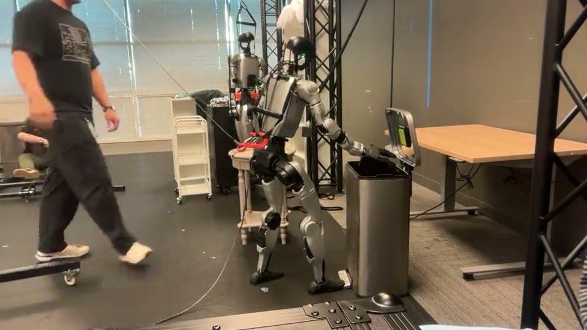
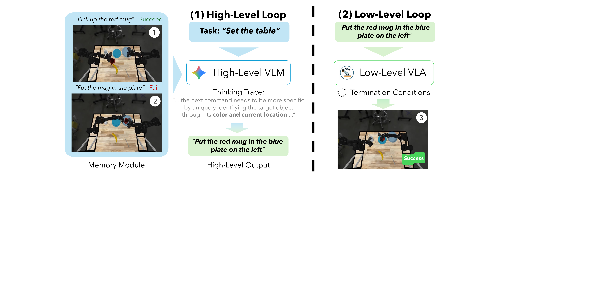

# 从目前的实验效果看，VLA 下一步做什么？

> 这不是一次从论文分类出发的综述，而是对我们目前实验进展的一次整理：已经能稳定做出来的是什么，继续沿着原来的路线优化还有多少收益，以及接下来哪些问题更值得投入。

## 目前的判断

在单个、受控的日常任务上，我们遇到的问题正在从“模型能不能学会”转成“数据是否覆盖正确的状态”。因此，除了继续做好桌面任务，我们也可以并行验证几类不同问题：扩大任务的空间范围、用调度器组合长程技能，以及借助接触任务建立真机强化学习闭环。

## 01 先从我们已经做出来的效果说起

### 1. 约 500 条数据，已经能把叠衣服做到可接受

- 我们收集了约 500 条叠衣服任务数据。
- 在pi05 基座上训练后，实际性能已经达到可以接受的水平。
- 对于固定本体、固定桌面和相对稳定的任务流程，获得基本可用能力所需的数据规模并没有想象中大。

### 2. 加入 χ₀ 数据后，模型还能学出更复杂的操作

- 在原有数据中加入 χ₀（kai0）数据后，模型能够学出先在空中抖动、将衣物展平，再继续折叠的操作。
- 这种行为不只是重复抓取和放置，而是包含了有意义的中间状态与操作策略。
- 这说明成熟基座已经具备较强的动作学习能力；数据里有没有出现关键操作方式，会直接影响模型最终能学出什么。

https://www.youtube.com/watch?v=av4EILJM_Bs

### 3. 前期“跑不通”主要是系统接口问题

- 策略早期一直跑不通、动作明显卡顿，一度看起来像是模型能力不足。
- 后来发现，主要问题来自坐标系变换没有处理正确，以及相邻 action chunk 之间缺少平滑衔接。
- 把坐标、时序和 chunk 衔接问题解决以后，很多原本归因于模型的异常现象也随之消失。

这个经验说明，判断模型效果之前，首先要确保坐标系、控制频率、动作表示和执行接口是正确的。否则系统层面的错误很容易被误判为学习能力不足。

### 4. 系统打通以后，问题基本转向“怎样收集数据”

- 哪些初始状态需要覆盖？
- 衣物处于不同形态时，是否都有对应示范？
- 数据里是否包含抖动、展平等关键中间操作？
- 模型执行偏离以后，有没有失败恢复轨迹可以学习？
- 不同类型的数据应该直接混合，还是分别训练后再组合？

因此，我们目前的感受是：在这类桌面任务上，成熟基座已经足够强。系统接口打通以后，剩余问题几乎都指向数据的质量、覆盖、组合和结构，而不是模型主干还需要怎样修改。

### 5. “做得差不多了”有一个明确边界

这里并不是说机器人操作已经解决，也不是说所有方法效果完全相同。这个判断特指以下实验设置：

- 机器人本体和基座位置固定；
- 相机视角和桌面高度基本不变；
- 物体与初始状态的分布有限；
- 任务只在一张桌面内完成；
- 整个任务链较短，失败后的恢复要求不高。

在这个范围内，叠衣服、叠方块、抓取放置和简单装配等任务，已经越来越难仅靠“是否能完成”来区分模型。继续优化架构仍可能带来提升，但它未必再是决定实验成败的首要变量。

一旦放宽这些条件，现有系统的问题仍会迅速暴露：

- 换房间、换高度、换视角后的稳定性；
- 移动、操作与全身控制的连续衔接；
- 长程任务中的终止判断和错误恢复；
- 毫米级、遮挡下的接触与受力控制。

### 6. 公开工作也支持这一观察

- π₀ 已经展示了洗衣折叠、装箱等灵巧任务。[[1]](#参考工作)
- π₀.₅ 通过异构联合训练，把能力推进到陌生家庭中的长程整理任务。[[2]](#参考工作)
- TurboVLA 用仅 0.2B 参数在 LIBERO 上报告了 97.7% 平均成功率，并在 RTX 4090 上达到约 31.2 ms 延迟。[[3]](#参考工作)

这些结果说明，对受控的单项日常任务而言，“能否完成”已经不必然依赖一个更大、更复杂的中心式 VLA。

但需要区分“任务做出来了”和“能力解决了”。2026 年的一项 benchmark audit 发现，一个 0.09B、没有语言编码器的 probe 也能在 LIBERO 上接近已有 SOTA；在加入空间、物体和指令扰动后，代表性 VLA 仍会显著掉点。更准确的说法是：**固定协议里的任务正在饱和，协议外的鲁棒性仍远未饱和。** [[4]](#参考工作) [[5]](#参考工作)

## 02 为什么我们开始更关注数据，而不是模型细节？

### 1. 同一个成熟基座，换数据就能学出不同层次的能力

- 从我们的实验看，π₀.₅ 这类成熟基座已经可以学会基本的叠衣服动作。
- 加入包含抖动、展平等操作的数据后，同一个基座又能学出更复杂的中间行为。
- 这说明当前的主要限制不一定是模型“不会”，而可能是训练数据根本没有告诉它这种状态和动作应该如何连接。

因此，在单个桌面任务上，首先值得问的不再是“要不要换一个 action head”，而是：**现有数据是否覆盖了我们希望模型学会的行为？**

### 2. 对我们当前的任务，直接训练已经足够

χ₀（kai0）论文提出了 Model Arithmetic、Stage Advantage 和 Train-Deploy Alignment，用来解决数据覆盖、长程阶段判断和部署时序不一致等问题。[[6]](#参考工作) 这些方法对构建一个能够长时间运行、处理失败恢复的完整系统有价值，但对我们目前的单桌面叠衣服实验，它们并不是最需要优先研究的部分。

我们的实际观察更简单：

- 不改 π₀.₅ 的模型结构；
- 不实现 Model Arithmetic；
- 不加入 Stage Advantage；
- 直接把原有数据与 χ₀ 数据交给 π₀.₅ 训练；
- 就已经能够得到可接受的折叠效果，并学出空中抖动、展平等操作。

因此，对当前任务来说，继续拆解 χ₀ 三个模块各自贡献多大，研究意义和投入产出比都比较有限。更直接的做法就是选一个成熟基座，把数据整理好以后直接训练，再用真实机器人结果判断还缺什么数据。

### 3. χ₀ 对我们的主要启发来自数据，而不是方法复现

χ₀ 最值得借鉴的不是必须照搬整套 pipeline，而是它展示了什么样的数据能够支持更完整的衣物操作：

- 衣物具有更多不同的初始形态；
- 轨迹包含抖动、展平、重新抓取等中间操作；
- 不只展示最终折叠动作，也覆盖从混乱状态逐步整理的过程；
- 数据中包含更多偏离标准轨迹后的处理方式。

把这些数据直接用于普通 π₀.₅ 微调后也能学出对应能力，反而进一步说明：对我们当前的任务，性能提升主要来自数据带来的行为覆盖，而不是必须依赖 χ₀ 特有的训练模块。

### 4. 接下来真正需要研究的是“怎样把数据收对”

更需要关注的是数据的结构：

- **状态覆盖**：不同衣物形态、初始位置和操作阶段是否都出现过？
- **关键中间行为**：是否包含抖动、展平、重新抓取等决定任务质量的动作？
- **失败附近状态**：模型偏离以后，是否有纠正和恢复轨迹？
- **子集组合**：不同来源、不同阶段的数据应该以什么比例混合？
- **部署一致性**：训练动作与真实机器人的坐标、频率、延迟和 chunk 执行方式是否一致？

对实验流程来说，可以采用一个很直接的循环：

> 先收一批数据 → 直接训练 → 上机器人测试 → 找到集中失败的状态 → 定向补数据 → 重新训练

下一阶段更值得优化的，可能不是 dataset size，而是 dataset geometry：覆盖了哪些状态、状态之间怎样连接，以及模型犯错以后能否在数据中找到回来的路径。

### 5. 已有 scaling 研究也表明，多样性比重复数量更重要

- 环境和物体的多样性，通常比在同一条件下重复采集更多 demonstration 更有价值。
- 同一状态下的重复数量达到一定阈值后，继续增加数据的边际收益会明显下降。[[7]](#参考工作)
- π₀.₅ 的开放环境泛化，也不是只靠增加机器人轨迹数量，而是依赖多机器人数据、网页视觉语言数据、目标检测、子任务预测和低层动作的异构联合训练。[[2]](#参考工作)

但数据中心不等于无差别堆数据。跨本体数据如果没有统一的物理表示和合理的采样比例，也可能产生负迁移。因此，数据质量、覆盖、动作表示、失败恢复和混合策略需要被当作一个整体来设计。[[8]](#参考工作)

### 6. 模型结构仍然重要，但不是当前选题重点

- 如果只问“能不能把东西放好”，架构差异的边际收益可能正在变小。
- 如果关心实时性、显存、控制频率和部署成本，架构仍然可能是决定性变量。
- TurboVLA 在 RTX 4090 上以约 30 Hz 运行的价值就在这里：它未必让方块叠得更聪明，却说明相近任务能力可以用更低成本、更高频率实现。

所以，我们不是得出“模型结构不重要”的结论，而是认为：**对于一个受控日常任务，模型首先要足够强；达到这个门槛以后，直接训练、真实测试和针对性补数据，通常比继续优化模型细节更有效。**

沿着这个判断继续往下，选题也会自然变化：与其只在同一张桌面上继续比较几个百分点，不如设计几个最小实验，让现有系统面对原来没有覆盖的问题。我们目前想到的三个并列方向，分别关注空间移动、长程调度和真机强化学习。

## 03 对目前几个工作方向的思考

基于前面的实验结果，我们目前想到三个可以继续探索的方向：带空间移动的操作、长程任务调度，以及面向真机强化学习的接触任务。它们并不是先后递进的路线，也还不能说哪一个方向一定更好；更合适的做法可能是分别设计一个最小实验，再结合机器人平台、复现成本和初步结果决定投入重点。

### A. 带空间移动的 VLA 任务

第一个方向是尝试把任务范围从一张桌面扩展到多个工作区。它能够比较自然地暴露现有固定桌面任务没有覆盖的问题，但同时也会引入较高的系统复现成本。

一个最简单的例子是：从桌 A 拿起物体，带着它移动，再放到桌 B。这个任务仍然可以复用我们已经训练好的抓取和放置能力，但机器人不再始终站在预先调好的最佳位置。

GR00T 官方已经给出了同类任务的完整 workflow，例如从货架取箱子放入蓝色容器，以及从小桌拿易拉罐投入垃圾桶。流程覆盖环境搭建、遥操作采集、LeRobot 数据转换、GR00T 后训练和闭环评估。这至少说明该方向有相对清楚的技术参考，但官方示例能够运行，并不意味着我们可以低成本地复现同样效果。[[9]](#参考工作)

一个移动操作任务可以拆成：

> 定位目标 → 走近桌面 → 建立操作姿态 → 抓取 → 携物移动 → 重新放置

官方记录中，“走到桌前并抓取”的成功率为 73.6%（159/216），“桌面易拉罐到垃圾桶”的成功率为 66.7%（8/12）。失败主要来自漏抓、抓取不稳定、把物体推出可达区域，以及踩不中垃圾桶踏板；自主重试被计为成功。

#### 目前比较担心的是复现成本

- **桌面策略**通常默认相机、基座、桌面高度和机械臂工作区相对固定。
- **移动操作**中，底盘或双足每次停靠都会改变视角、距离、可达性和后续抓取分布。
- **全身系统**还要匹配遥操作设备、手爪、全身控制器、相机同步、地面摩擦和安全边界。
- **误差会逐级传播**：前一阶段少停十厘米，可能让后面的视觉输入和关节可达域一起偏移。

一个相对保守的起点，是只做“桌 A 取物—移动—桌 B 放置”的最小闭环，允许导航或底盘继续使用现有模块，并分别记录到位、抓取、携物和放置成功率。先确认各阶段能否稳定连接，再决定是否扩大场景。

### B. 用调度器把局部能力接成长程任务

一旦任务跨越多个位置和阶段，问题就不再只是每个动作能否做好，还包括下一步做什么、何时切换、失败以后回到哪里。长程任务未必需要一个 VLA 从头控制到尾；更现实的做法，是在已有局部技能外面加一个调度器。

Harness VLA 不让 agent 直接输出关节动作，也不允许它在部署时发明新技能。它只暴露一组很小的固定原语：移动、姿态调整、夹爪控制、底盘导航，以及唯一的学习型原语 `VLA_ACT`。每次调用 VLA 前先把机器人放进合适的局部状态，调用后重新观察和验证；如果接触不稳定，就换姿态或视角再试。[[10]](#参考工作)

可以把这套结构概括成：

- **高层调度器**：分解、选择、验证、恢复。
- **解析原语**：导航、对齐、搬运。
- **Frozen VLA**：抓取、插入、开合。
- **系统模块**：成功检测、记忆。

#### 这些结果对我们做调度器有什么启发？

- **高层 reasoning 比单纯扩大高层 VLM 更重要。** 开启 thinking 持续改善结果，但 Lite、Flash、Pro 的规模差异没有稳定转化为系统收益。
- **低层 VLA 的 steerability 是瓶颈。** 任务内微调如果损害指令跟随能力，长程组合表现反而会明显下降。
- **何时切换和用什么状态切换很重要。** 成功检测通常优于预先猜测执行时间；固定时长时，4–8 秒是论文建议的折中范围。
- **结构化观测比原始图像更可靠。** Bounding box 和接触信息能显著改善高层判断。
- **原始历史不是有效记忆。** 简单增加当前 episode 的上下文帮助很小，跨 episode 提炼出的成功经验更有价值。

论文中，在使用相同底层 VLA 和初始任务指令的情况下：

| 配置 | 短程 | 长程 | 推理 | 真实 ALOHA |
|---|---:|---:|---:|---:|
| Best hierarchy | 78.22% | 67.08% | 80.89% | 12/15 |
| Naive hierarchy | 69.57% | 40.56% | 66.49% | 9/15 |
| Flat VLA | 69.63% | 25.30% | 50.90% | 3/15 |

优势主要出现在需要组合与推理的任务，而不是最短的原子技能。[[11]](#参考工作)

对我们来说，一个最小实现可以先冻结现有 VLA，只增加少量解析原语、成功检测和重试逻辑，观察不同技能之间的 handoff 是否真的改善长程成功率。这个方向的难点，是需要证明系统收益来自可泛化的调度能力，而不只是为单个任务手写状态机。

### C. 用精细接触任务进入真机强化学习

第三个方向是把插头插座、精细插入等接触任务作为真机强化学习的切入口。这里关注的不只是“做得更准”，而是如何让策略在真实机器人上经历失败、获得反馈，并通过自主 rollout 和人类干预继续提高。
> 成功示范 → 监督微调 → 机器人 rollout → 失败与人类干预 → 奖励和价值学习 → RL 后训练

### 三个方向的并列关系

| 方向 | 主要想研究的问题 | 可以先做的最小实验 | 主要风险 |
|---|---|---|---|
| 带空间移动的操作 | 固定桌面技能能否适应位置和视角变化 | 桌 A 取物—移动—桌 B 放置 | 全身控制与硬件复现成本 |
| 长程任务调度 | 已有局部技能能否可靠组合、切换和恢复 | Frozen VLA + 少量原语 + 成功检测 | 容易退化为任务特定的手写状态机 |
| 接触任务与真机强化 | 策略能否利用失败、奖励和干预继续学习 | 单一插入任务的 BC—rollout—离线 RL 闭环 | 奖励设计、真机安全和 rollout 成本 |

### 目前的看法

这三个方向分别改变任务的空间范围、组织方式和学习方式，彼此之间没有必然的先后关系。现阶段我们还不需要预先确定一条唯一主线，也没有必要从零训练 foundation VLA。更现实的做法是沿用成熟基座，为每个方向建立一个成本可控、指标清楚的最小实验，再根据结果决定后续重点。

## 参考工作

1. [π₀: A Vision-Language-Action Flow Model for General Robot Control](https://arxiv.org/abs/2410.24164), 2024.
2. [π₀.₅: A Vision-Language-Action Model with Open-World Generalization](https://arxiv.org/abs/2504.16054), 2025.
3. [TurboVLA: Real-Time VLA at 32 Hz on an RTX 4090](https://arxiv.org/abs/2607.27205), 2026.
4. [What Are We Actually Benchmarking in Robot Manipulation?](https://arxiv.org/abs/2606.04233), 2026.
5. [LIBERO-X: Robustness Litmus for Vision-Language-Action Models](https://arxiv.org/abs/2602.06556), 2026.
6. [χ₀: Resource-Aware Robust Manipulation via Taming Distributional Inconsistencies](https://arxiv.org/abs/2602.09021), 2026.
7. [Data Scaling Laws in Imitation Learning for Robotic Manipulation](https://arxiv.org/abs/2410.18647), 2024.
8. [Rethinking VLA Scaling: Alignment, Mixture, and Regularization](https://arxiv.org/abs/2602.09722), 2026.
9. [NVIDIA GR00T Loco-Manipulation Workflow](https://github.com/isaac-sim/IsaacLab-Arena/blob/main/docs/pages/example_workflows/locomanipulation/index.rst), 2026.
10. [Harness VLA: Steering Frozen VLAs into Reliable Manipulation Primitives](https://arxiv.org/abs/2607.08448), 2026.
11. [What Matters in Orchestrating Robot Policies](https://arxiv.org/abs/2606.10267), 2026.
12. [ForceVLA: Enhancing VLA Models with a Force-Aware MoE](https://arxiv.org/abs/2505.22159), 2025.
13. [NVIDIA Isaac GR00T FAQ](https://github.com/NVIDIA/Isaac-GR00T/blob/main/FAQ.md), 2026.
14. [A VLA that Learns from Experience: π*₀.₆ / RECAP](https://www.pi.website/blog/pistar06), 2025.
15. [VLA in Robotics: A Survey of Datasets, Benchmarks, and Data Engines](https://arxiv.org/abs/2604.23001), 2026.
